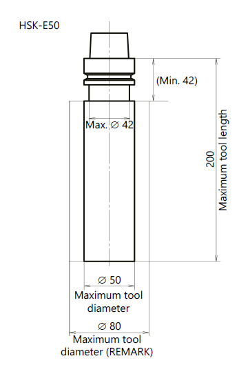

# Overview

DIY CNC microscope based on Raspberry Pi cameras

# Overview

## Variations and use cases

There are multiple possible variations for different use cases

Main components that will be included all of them
1. Raspberry Pi
2. Raspberry Pi camera
3. Lens
4. Light

1. On a milling machine spindle for positioning
   1. Wired with RaspBerry Pi on the side
   2. Wireless that fits into a tool carriage
2.

2. Wired microscope with 
3. Wired
4. Wireless thet fits to a spindle

# Wireless microscope for HSK-50 spindle

There can be multiple form factors

## Operation

### Application

The main viewing appication is run on a computer next to the machine.
It's main tasks are to

- Control the Raspberry Pi on the spindle camera
- Centering and reorientation calculations
- Adding overlay on the video

#### Centering

1. At least two, prefererrably more, pictures are taken in different rotational angles.
2. From these pictures the center pixel is calculated.
3. Images are then cropped around this center point.
4. Picture is taken of referece maker shaped like L
5. Image is rotation is calculated from this picture 

##### Marker

Marker would be composed of two thin, (5-20 pixels wide in the camera) perpendicular lines.
The lines would be aligned with the machine X and y-axis with some calibration values possible.

### Communcation

Communication has simple master-slave server structure.
The application is the master and the spindle unit is slave server.

Communication data format is
1. header
2. data
3. CRC value of data

##### Application to Server

Header:

1. Data length as 7 bit number
2. 1 checksum bit

Data:

1. Command
2. [Optional] data
 
CRC Value: 8 bits

##### Server to Application

Header:

1. Data length as 32 bit value
2. 8 bit CRC value of the length

Data:

1. Status
2. Image data

CRC value: 32 bits

#### G-code control

If it is possible, the application could control the machine directly.

Features
- Tool change
- Spindle rotations for centering and movement to angle reference picture
- Autofocus using vertical movement
- Spindle lock engagement
- Jogging

### Spindle unit

- Control camera and light
- Running the server
- Preprocessing RAW images for centering
  1. Selcting green channel only
  2. 
- Preprocess images for the video feed
  1. Select green channel only
  2. Cropping and rotating around the center center point
  3. Compressing to JPEG
- Taking RAW and JPEG images
- Taking MPEG videos

## Mounting

Maximum available space is composed of two cylinders.
1. 158 mm x 50 mm
2. 42 mm x 42 mm

The second cylinder is inside the toolholder

## Components

### On the spindle unit

| Component                             | Info                                                 |
| ------------------------------------- | ---------------------------------------------------- |
| Raspberry Pi Zero 2 W                 | Camera control, preprocessing, communication         |
| Raspberry Pi HQ Camera with c-mount   | Camera sensor                                        |
| Lens                                  | Preliminarily 100 mm x 28 mm                         |
| Ring light, maybe green               | for green monochrome green light would be sufficient |
| Battery                               |
| Voltage regulator and battery charger |
| IP68 housing                          | To protect from accidental coolant                   |

### On the tool holder

| Component            | Info                                                   |
| -------------------- | ------------------------------------------------------ |
| Charging station     | On the tool rack, Custom 5V                            |
| Connection detection | RasPi able to detect when the unit is on the tool rack |

### Others

| Component                                | Info |
| ---------------------------------------- | ---- |
| Computer setup for using the application |
| Wifi-4 network hardware                  |

