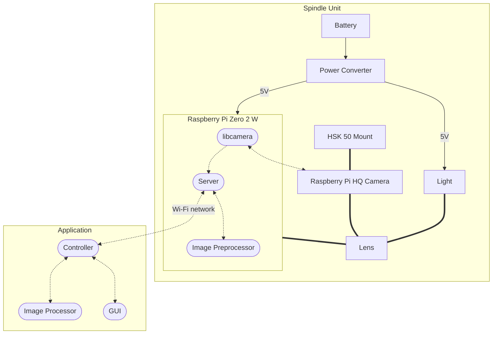
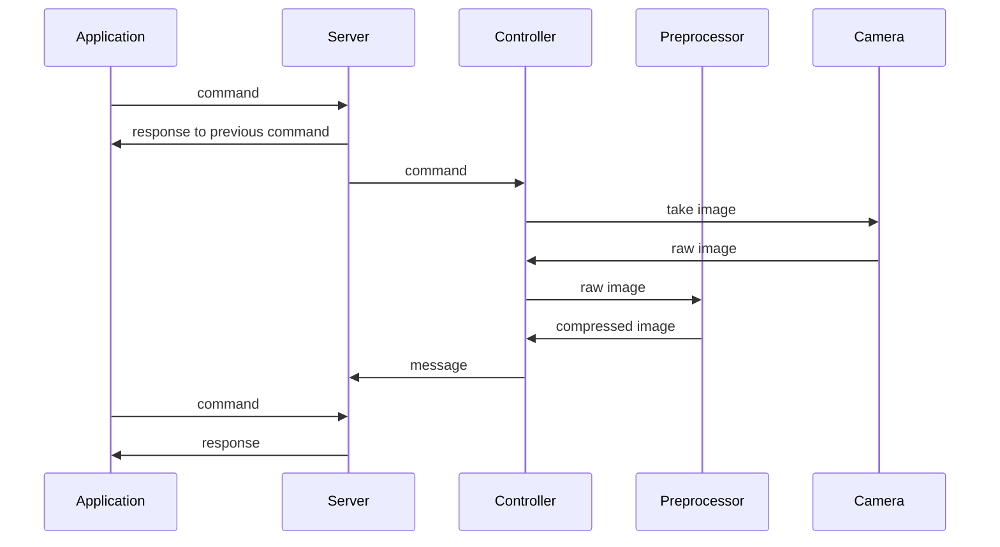
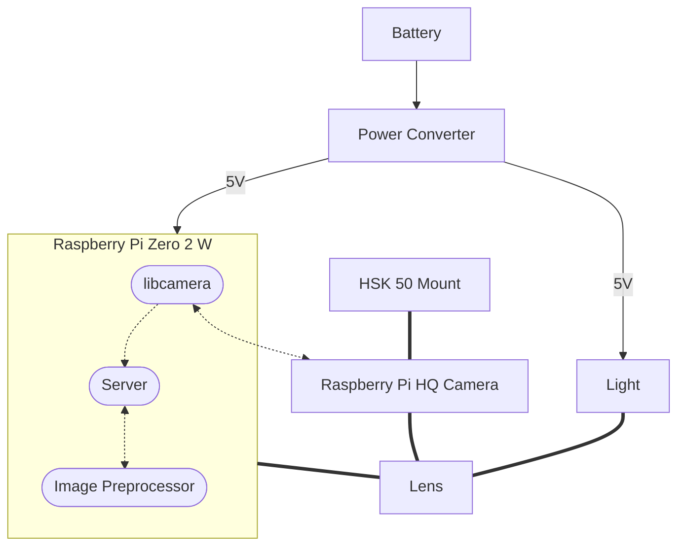

# Overview

DIY CNC microscope based on Raspberry Pi cameras

## Table of contents

- [Overview](#overview)
  - [Table of contents](#table-of-contents)
  - [Variations and use cases](#variations-and-use-cases)
- [Wireless microscope for HSK-E50 spindle](#wireless-microscope-for-hsk-e50-spindle)
  - [Operation](#operation)
    - [Application](#application)
      - [Centering](#centering)
        - [Marker](#marker)
    - [Communcation](#communcation)
      - [Format](#format)
        - [Application to Server](#application-to-server)
        - [Server to Application](#server-to-application)
      - [G-code control](#g-code-control)
  - [Spindle unit](#spindle-unit)
    - [Mounting](#mounting)
    - [Software](#software)
  - [Components](#components)
    - [On the spindle unit](#on-the-spindle-unit)
  - [Charging station](#charging-station)
    - [Others](#others)
- [High Dynamic Range imaging](#high-dynamic-range-imaging)
  - [Paradigms](#paradigms)
  - [Algorithm](#algorithm)
    - [preparing green-only](#preparing-green-only)
    - [Preparing the images](#preparing-the-images)
    - [Merging the images](#merging-the-images)
  - [Other](#other)
  - [Weights](#weights)
    - [4th power?](#4th-power)


## Variations and use cases

There are multiple possible variations for different use cases

Main components that will be included all of them
1. Raspberry Pi
2. Raspberry Pi camera
3. Lens
4. Light


1. On a milling machine spindle for positioning
   1. Wired with RaspBerry Pi on the side
   2. Wireless that fits into a tool carriage
2.


2. Wired microscope with
3. Wired
4. Wireless thet fits to a spindle

------------------------------------------------------------------------

# Wireless microscope for HSK-E50 spindle

Two main parts

1. Spindle unit that has the camera
2. Application on a computer

Additionally

1. Wi-Fi networking equipment for communication
2. Charging station for the spindle unit



## Operation

Main operating mode is greyscale video at 30-60 fsp

IDEA: Foveated compression?
- Split image into 9 segments
  - 1 center square section with best quality
  - Surrounding it 4 rectangle sections with lesser quality
  - Surrounding them 4 rectangle section with lowest quality

### Application

The main viewing appication is run on a computer next to the machine.
It's main tasks are to

- Control the Raspberry Pi on the spindle camera
- Centering and reorientation calculations
- Adding overlay on the video

#### Centering

1. At least two, prefererrably more, pictures are taken in different rotational angles.
2. From these pictures the center pixel is calculated.
3. Images are then cropped around this center point.
4. Picture is taken of referece maker shaped like L
5. Image is rotation is calculated from this picture

##### Marker

Two options:

Two thin, (5-20 pixels wide in the camera) perpendicular lines.
The lines would be aligned with the machine X and y-axis with some calibration values possible.
- Simpler to

ARUCO marker

- More complex to make
- Can be parsed with OpenCV

### Communcation

Communication has simple master-slave server structure.
The application is the master and the spindle unit is slave server.

Using Python socket module



This would happen concurrently, probaly using multiple processes.
At any time during video mode there would be
- One image being sent
- Second image being preprocessed
- Third image being taken

Target would be 60 fps, so none of these should take more than 16 ms.


#### Format

Communication data format is
1. header
2. data
3. CRC value of data

##### Application to Server

Header:

1. Data length as 7 bit number
2. 1 checksum bit

Data:

1. Command
2. [Optional] data

CRC Value: 8 bits

##### Server to Application

Header:

1. Data length as 32 bit value
2. 8 bit CRC value of the length

Data:

1. Status
2. Image data

CRC value: 32 bits

#### G-code control

If it is possible, the application could control the machine directly.

Features
- Tool change
- Spindle rotations for centering and movement to angle reference picture
- Autofocus using vertical movement
- Spindle lock engagement
- Jogging

## Spindle unit

- Control camera and light
- Running the server
- Preprocessing RAW images for centering
  1. Selcting green channel only
  2.
- Preprocess images for the video feed
  1. Select green channel only
  2. Cropping and rotating around the center center point
  3. Compressing to JPEG
- Taking RAW and JPEG images
- Taking MPEG videos

| Component                             | Info                                                 |
| ------------------------------------- | ---------------------------------------------------- |
| Raspberry Pi Zero 2 W                 | Camera control, preprocessing, communication         |
| Raspberry Pi HQ Camera with c-mount   | Camera sensor                                        |
| Lens                                  | Preliminarily 100 mm x 28 mm                         |
| Ring light, maybe green               | for green monochrome green light would be sufficient |
| Battery                               |
| Voltage regulator and battery charger |
| IP68 housing                          | To protect from accidental coolant                   |



### Mounting

Maximum available space is composed of two cylinders.
1. 158 mm x 50 mm
2. 42 mm x 42 mm

The second cylinder is inside the toolholder


### Software


## Components

### On the spindle unit


## Charging station


| Component            | Info                                                   |
| -------------------- | ------------------------------------------------------ |
| Charging station     | On the tool rack, Custom 5V                            |
| Connection detection | RasPi able to detect when the unit is on the tool rack |

### Others

| Component                                | Info |
| ---------------------------------------- | ---- |
| Computer setup for using the application |
| Wifi-4 network hardware                  |


# High Dynamic Range imaging

## Paradigms

- Branchless (to work later on RasPi OpenCL)
- Data-oriented

## Algorithm

- input is 12 bits, so `over` is $2^{12} -1$
- output has ~13-14 bits of precision

### preparing green-only

1. Separate green1 and green2 from the image
2. Add green1 and green2
3. Bithshift green1 by one
4. Add back the first bit from the sum

```python
green_sum = green1 + green2
green = (green_sum >> 1) + (green_sum & 1)
```
### Preparing the images

1. Take raw image
2. Convert to uint16 array
3. Calculate weight array
   - quadratic `((x >> n) * ((over - x) >> n))>>s`
   - n = 3
   - s = 12
   - Maximum weight 15 (16)
   - overexposed = 0
   - underexposed = 0
   - Exception fo the middle image. Add 1 to weight to handle over or underexposed
4. Add weight array to weight accumulator
5. Multiply the image by the weight array


### Merging the images

1. Add 1 to accumulator to handle over or underexposed images
1. Divide each image by the weight array accumulator.
   1. Special case accumulator zero. return last image instead
2. Bitshift each image by the exposure index
3. Add the images together
4. Save the raw data


## Other

$$
b = max(\frac{x}{d} \cdot \frac{a - x}{d})
  = \frac{a / 2}{d} \cdot \frac{a - a / 2}{d}
$$
$$
b = \frac{a^2}{4 \cdot d^2}
$$
$$
d = \sqrt{\frac{a^2}{4 \cdot b}} = \frac{a}{2 \cdot \sqrt{b}} = 2^n
$$
$$
n = ceil(log_2(\frac{a}{2 \cdot \sqrt{b}}))
$$

## Weights

### 4th power?

$$
a \cdot x^4 + b \cdot x^3 + c \cdot x^2 + d \cdot x
$$

$$
a + b + c + d = 0
$$
$$
a/4 * 0.5^3 + b / 3 * 0.5^2 + c / 2 * 0.5 + d = 0
$$
$$
a/4 + b / 3 + c / 2 + d = d
\rightsquigarrow a/4 + b / 3 + c / 2 = 0
$$
$$
a/4/3 * 0.5^2 + b / 3 / 2 * 0.5 + c / 2 = 0
$$

$$
\begin{matrix}
   1 & 1 & 1 & 1 \\
   1/32 & 1/12 & 1/2 & 1 \\
   1/4 & 1/3 & 1/2 & 0 \\
   1/48 & 1/12 & 1/2 & 0
\end{matrix}\ \cdot \
\begin{matrix}
   a  \\
   b  \\
   c \\
   d
\end{matrix} =
\begin{matrix}
   0  \\
   0  \\
   0 \\
   0
\end{matrix}
$$
